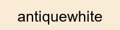
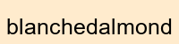

# Markdown-Highlighters
Instead of the boring `==`  and `==` markdown highlight, these are the HTML codes for you to copy/paste to make your markdown highlights colorful.

`aliceblue`

`antiquewhite`

`aqua`

`aquamarine`

`azure`

`beige`

`bisque`

`black`

`blanchedalmond`

`blue`

`blueviolet`

`brown`

`burlywood`

`cadetblue`

`chartreuse`

`chocolate`

`coral`

`cornflowerblue`

`cornsilk`

`crimson`

`cyan`

`darkblue`

`darkcyan`

`darkgoldenrod`

`darkgray`

`darkgreen`

`darkgrey`

`darkkhaki`

`darkmagenta`

`darkolivegreen`

`darkorange`

`darkorchid`

`darkred`

`darksalmon`

`darkseagreen`

`darkslateblue`

`darkslategray`

`darkslategrey`

`darkturquoise`

`darkviolet`

`deeppink`

`deepskyblue`

`dimgray`

`dimgrey`

`dodgerblue`

`firebrick`

`floralwhite`

`forestgreen`

`fuchsia`

`gainsboro`

`ghostwhite`

`gold`

`goldenrod`

`gray`

`green`

`greenyellow`

`grey`

`honeydew`

`hotpink`

`indianred`

`indigo`

`ivory`

`khaki`

`lavender`

`lavenderblush`

`lawngreen`

`lemonchiffon`

`lightblue`

`lightcoral`

`lightcyan`

`lightgoldenrodyellow`

`lightgray`

`lightgreen`

`lightgrey`

`lightpink`

`lightsalmon`

`lightseagreen`

`lightskyblue`

`lightslategray`

`lightslategrey`

`lightsteelblue`

`lightyellow`

`lime`

`limegreen`

`linen`

`magenta`

`maroon`

`mediumaquamarine`

`mediumblue`

`mediumorchid`

`mediumpurple`

`mediumseagreen`

`mediumslateblue`

`mediumspringgreen`

`mediumturquoise`

`mediumvioletred`

`midnightblue`

`mintcream`

`mistyrose`

`moccasin`

`navajowhite`

`navy`

`oldlace`

`olive`

`olivedrab`

`orange`

`orangered`

`orchid`

`palegoldenrod`

`palegreen`

`paleturquoise`

`palevioletred`

`papayawhip`

`peachpuff`

`peru`

`pink`

`plum`

`powderblue`

`purple`

`rebeccapurple`

`red`

`rosybrown`

`royalblue`

`saddlebrown`

`salmon`

`sandybrown`

`seagreen`

`seashell`

`sienna`

`silver`

`skyblue`

`slateblue`

`slategray`

`slategrey`

`snow`

`springgreen`

`steelblue`

`tan`

`teal`

`thistle`

`tomato`

`turquoise`

`violet`

`wheat`

`white`

`whitesmoke`

`yellow`

`yellowgreen`
